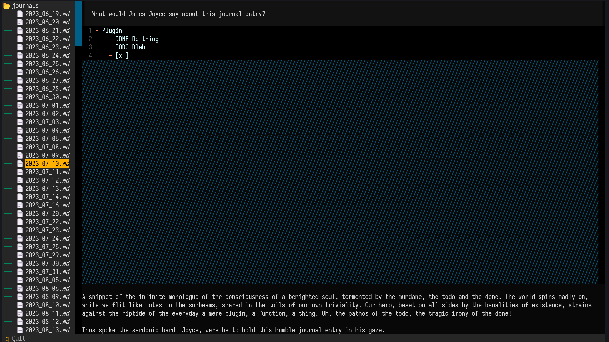

# About

Browse a local file directory and send file contents to a Cohere agent using custom prompts.

# Example



# Quickstart

- Required: Python 3.11+
- Git clone the repo: `git clone https://github.com/davidbrackbill/file_agent`
- Run `pip install -r requirements.txt`
- CD to `src`
- Create a `config.json` with `{"key": "YOUR_COHERE_API_KEY"}`
- Run `py code-browser YOUR_PATH`, where `YOUR_PATH` is a directory with interesting, but not *too interesting*\*, text files.

\*Upon clicking on a file, this app sends the file's contents to the Cohere LLM! **DO NOT** provide paths with any sensitive content inside of them.

# Config

- `key` (required) Cohere API key
- `syntax` (optional) file styling [default as below]
- `preamble` (optional) system prompt for the LLM. [default = ""]

``` json
{
  "key": "YOUR_COHERE_API_KEY",
  "syntax": {
    "line_numbers": true,
    "word_wrap": false,
    "indent_guides": true,
    "theme": "github-dark"
  },
  "preamble": "## Task & Context\nYou help people answer their file-related questions using a file tool to grab the contents, and then apply analysis, tone switching or editing on the contents.\n\n## Style Guide\nRespond in the user-requested style at all costs."
}
```
